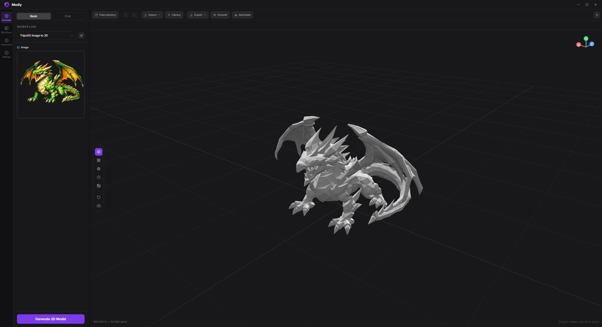
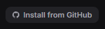
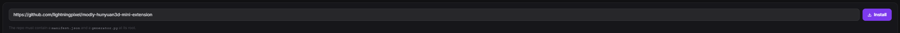
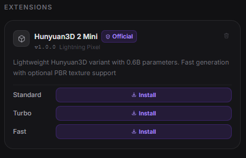

<p align="center">
  
</p>

# Modly

**Local, open source, AI-powered image-to-3D mesh generation.**
Turn any photo into a 3D model using open source AI models running entirely on your GPU.
Modly is a desktop application for Windows, Linux, and Apple Silicon macOS.

> Created by [Lightning Pixel](https://github.com/lightningpixel)

<p align="center">
  
</p>

---


## Download

Head to the [Releases](../../releases/latest) page to download the latest installer for Windows, Linux, or Apple Silicon macOS.

Alternatively, you can clone the repository and run the app directly without installing:

```bash
# Windows
launch.bat

# Linux / macOS
./launcher.sh
```

---


## Getting started

### 1. Install JS dependencies

```bash
npm install
```

### 2. Set up Python backend

```bash
cd api
python -m venv .venv
.venv\Scripts\activate     # Windows
source .venv/bin/activate  # Linux / macOS
pip install -r requirements.txt
```

### 3. Run in development

```bash
npm run dev
```

### 4. Test

```bash
npm test
./node_modules/.bin/tsc --noEmit -p tsconfig.node.json
npm run build
```

## Platform notes

- macOS support targets Apple Silicon only.
- macOS uses native window controls. Windows and Linux keep the existing custom controls.
- The top bar includes a live RAM indicator sourced from the main process.
- Workflow wiring is validated before run; invalid graphs stay in place and surface inline/toast warnings instead of dropping the current mesh view.
- Package Apple Silicon macOS with `npm run package:mac`.
- Imported meshes can be smoothed and decimated in-app; optimized results are written back into the workspace.

---

## Extension system

Modly supports external model and process extensions. Each extension is a GitHub repository containing a `manifest.json` plus the runtime entry files required by its type.

### Official extensions

| Extension | Model | URL |
|-----------|-------|-----|
| [modly-hunyuan3d-mini-extension](https://github.com/lightningpixel/modly-hunyuan3d-mini-extension) | Hunyuan3D 2 Mini | https://github.com/lightningpixel/modly-hunyuan3d-mini-extension |
| [modly-hunyuan3d-mini-turbo-extension](https://github.com/lightningpixel/modly-hunyuan3d-mini-turbo-extension) | Hunyuan3D 2 Mini Turbo | https://github.com/lightningpixel/modly-hunyuan3d-mini-turbo-extension |
| [modly-hunyuan3d-mini-fast-extension](https://github.com/lightningpixel/modly-hunyuan3d-mini-fast-extension) | Hunyuan3D 2 Mini Fast | https://github.com/lightningpixel/modly-hunyuan3d-mini-fast-extension |
| [modly-triposg-extension](https://github.com/lightningpixel/modly-triposg-extension) | TripoSG | https://github.com/lightningpixel/modly-triposg-extension |
| [modly-trellis2-gguf-extension](https://github.com/lightningpixel/modly-trellis2-gguf-extension) | Trellis2 GGUF | https://github.com/lightningpixel/modly-trellis2-gguf-extension |

### How to install an extension

**1.** Go to the **Models** page and click **Install from GitHub**.



**2.** Enter the HTTPS URL of the extension repository and confirm.



**3.** If the extension exposes model nodes, download the model or one of its variants. Process extensions are ready once installation and setup complete.



---

## Modly CLI

Agents and scripts can call a running Modly desktop app without using the UI via the stdlib-only CLI. The CLI is a thin helper over Modly's canonical automation concepts and keeps final machine-readable JSON on stdout:

```bash
python tools/modly-cli/agent.py health
python tools/modly-cli/agent.py model list
python tools/modly-cli/agent.py workflow-run status <run_id>
python tools/modly-cli/agent.py generate --image ./input.png --output ./export.glb
```

Canonical commands are `health`, `model`, `workflow-run`, `capability`, and `process-run`. The friendly `generate` command starts `POST /workflow-runs/from-image`, polls the returned run, exports the final mesh when requested, and includes recovery metadata such as `workflow-run status ...` and `workflow-run cancel ...` in the JSON response.

Compatibility and helper surfaces are intentionally separated: `legacy` wraps old `/generate/*` job endpoints, `dev serve-api` / `dev ensure-server` start only the FastAPI backend and do not prove Electron/Desktop bridge readiness, and `experimental comfy-image` / `experimental generate-from-workflow` are external ComfyUI orchestration helpers rather than the canonical Modly agent contract. Hidden helper aliases such as `status`, `export`, and `batch` remain parseable for scripts, but they are not presented as canonical root commands.

`experimental generate-from-workflow --workflow <name> --output <path>` treats `--output` as the final artifact location. When the ComfyUI workflow produces a downloadable 3D asset, the CLI downloads it directly; image-only workflows remain a compatibility path through Modly image-to-3D generation.

See `tools/modly-cli/SKILL.md` for the agent workflow and output contract.

---

### Community

Join the [Discord server](https://discord.gg/BvjDCvS3yr) to stay up to date with the latest news, report bugs, and share feedback.

---

## Sponsors

<p align="center">
  Thanks to our early sponsors for believing in Modly and helping make local AI 3D generation more accessible.
</p>

<p align="center">
  <kbd>
    
    <br />
    <sub><a href="https://github.com/DrHepa">DrHepa</a></sub>
  </kbd>
  &nbsp;&nbsp;
  <kbd>
    
    <br />
    <sub><a href="https://github.com/benjapenjamin">benjapenjamin</a></sub>
  </kbd>
  &nbsp;&nbsp;
  <kbd>
    
    <br />
    <sub><a href="https://github.com/iammojogo-sudo">iammojogo-sudo</a></sub>
  </kbd>
</p>

---

## License

MIT License — see [LICENSE](LICENSE) for details.

**If you fork this project and build your own app from it, you must credit the original project and its creator:**

> Based on [Modly](https://github.com/lightningpixel/modly) by [Lightning Pixel](https://github.com/lightningpixel)

This is a requirement of the MIT license attribution clause. Please keep this credit visible in your app's UI or documentation.

## Star History

<a href="https://www.star-history.com/?repos=lightningpixel%2Fmodly&type=timeline&legend=top-left">
 <picture>
   <source media="(prefers-color-scheme: dark)" srcset="https://api.star-history.com/chart?repos=lightningpixel/modly&type=timeline&theme=dark&legend=bottom-right" />
   <source media="(prefers-color-scheme: light)" srcset="https://api.star-history.com/chart?repos=lightningpixel/modly&type=timeline&legend=bottom-right" />
   
 </picture>
</a>
